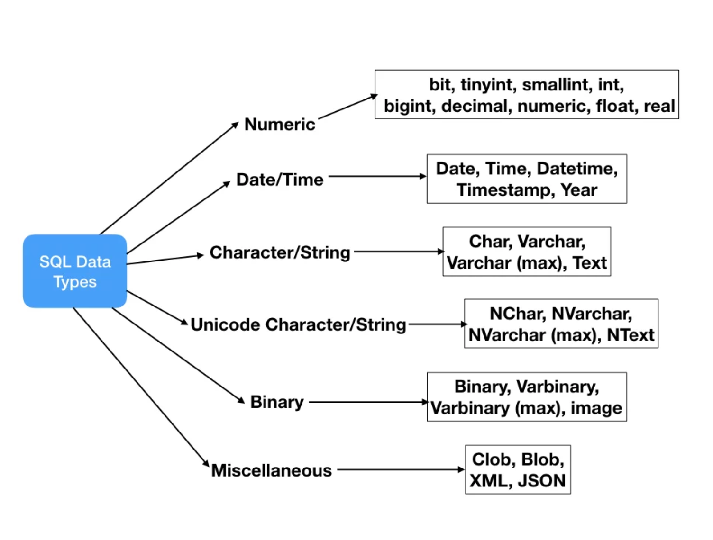

# SQL intro

Working with databases is a way to save data for our website. 


## Learning objectives

- What is a database and why use it?
- Can create a database using `CREATE SCHEMA`
- Creating tabels with `CREATE TABLE`
- Can insert data into a databse using `INSERT` also using a sql script
- Can use SQL `SELECT` statement to get data from a table


## Quickly about SQL

**DML** (**D**ata **M**anipulation **L**anguage) – Commands that change data in the database	

	- SELECT
	- INSERT
	- UPDATE
	- DELETE


**DDL** (**D**ata **D**efinition **L**anguage) – Commands that define the database

	- Create
	- Alter
	- DROP


## Creating a Database

Create a new database using the  `CREATE SCHEMA` SQL

 `CREATE SCHEMA product_database`

This will create a new database called `product`


In SQL  use `use` to specify which database to run the script against.

`use product`


## Creating tables

To create a new table use the `CREATE TABLE` SQL sentence

```sql
USE product_database;

CREATE TABLE product (	
  id INT,
	price INT, 
	name VARCHAR(30), 
	description VARCHAR(255)
); 
```


### SQL types

There are lots of different types in SQL. I will explain the most used types here

- `INT` - Stores an integer
- `VARCHAR` - Stores a number of characters. Fx `VARCHAR(50)` stores text that can be maximum 50 characters long.
- `DATE` - Stores dates. Format is  `YYYY-MM-DD`
- `DECIMAL` - Stores a decimal. Fx `DECIMAL(3, 5)` can store a number that is max 3 digits before the decimal and 5 after the decimal. So 312.43245 but not 312.432456




You can read more about them here: https://www.journaldev.com/16774/sql-data-types


### Create table exercise - 15 min

Lets continue in the Social Media Post universe 👩‍💻👨‍💻

First create a new database called `social_media_database`

In the `social_media_database` create a table called `post` that has these columns

- Id
- Title
- Content (the text of the social media post)
- Date
- Number of likes


## Inserting data into a SQL table

To insert data into a SQL table use the `INSERT INTO` statement. 

```sql
INSERT INTO product (id, price, name, description) VALUES (1, 100,'Shoe','A shoe with a nice patina');
```

So lets disect this statement:

`INSERT INTO product` - tells the database that we are interested in inserting data to the `product` table.

`(id, price, name, description) ` specifying what columns we will be inserting data into

`VALUES` tells the values/data we will be inserting into the database

`(1, 100,'Shoe','A shoe with a nice patina')` - The actual data comma seperated


### Inserting using a SQL Script

Simply open the script in Workbench and run the script. Remember to sepcify the database to use using the `use` SQL command


*Question*

What would happen if i ran this SQL statement?

```sql
INSERT INTO product (id, price) VALUES (1, 100);
```


### Exercise - 15 min

Insert 3 posts into the `post` table you created in the exercise above

*Be wary of dates!*


## Getting data from a table

To get data from out table we use the `SELECT` command. Here is a practical example

```sql
SELECT * FROM product;
```

`SELECT *` tells the database that we will be selecting all columns (`*`) from a table. You can also write column names here to only get fx `price`

`FROM product` specifies that we be selecting data from the `product` table. 


### `WHERE`

`WHERE ` specifies a condition that has to be met for the reteieved entries

```sql
SELECT name FROM product WHERE price > 40
```

`SELECT name` - Select the column called `name`

`WHERE price > 40` - Select only the entries where the `price` column is larger than 40


### `ORDER BY`

`ORDER BY` is used to sort the results

```sql
SELECT name 
FROM product 
WHERE price > 40 
ORDER BY PRICE DESC
```

`ORDER BY PRICE DESC` tells the database to order the results by the price with the high prices in first


## Aggregate functions

- `AVG`
- `COUNT`
- `SUM`
- `MIN`
- `MAX`


Can be used like this:

```sql
SELECT count(*) 
FROM product 
WHERE price > 40 
```

This will answer how many products have a price that is larger than 40


```sql
SELECT MAX(price) 
FROM product 
```

What is the most expensive product


## SQL Workbench can help with everything!

- Selection
- Creating of table
- Creating of database
- Insertion


## Exercises - rest of class

We will be working with a database that has employeers and departments. To get the tables and data, create a new database and run the script below against that database. Remember the `use` SQL command

https://github.com/behu-kea/dat20-classes/blob/master/SQL/assets/create-emp-dept-database.sql

When all the data has been inserted that writing SQL statements to answer the questions below:

1. List all information about all departments
2. Find the employee number (empno) for employees named MARTIN.
3. Find the employee(s) with a salary greater than 1500.
4. Find all job types – list each only once.
5. List the names of salesmen that earn more than 1300
6. List the names of employees that are not salesmen
7. List the names of all clerks together with their salary with a deduction of 10%
8. Find the name of employees hired before May 1981.
9. List total sum of salary and commission for all employees
10. List sum of salary PLUS commission for employees that have commission
11. List name and job for employees whose name ends with ‘s’;
12. List employees sorted by name
13. List employees sorted by salary in descending order (i.e. highest salary first)
14. Find name of employee without a manager (i.e. the CEO)
15. List departments sorted by location
16. Find name of department located in New York
17. List the number of employees
18. List the sum of all salaries (excluding commission)
19. List the average salary for employees in department 20
20. List the unique job titles in the company
21. List the number of employees in each department
22. List in decreasing order the maximum salary in each department together with the department number


## SQL best practices

https://www.sqlshack.com/learn-sql-naming-conventions/