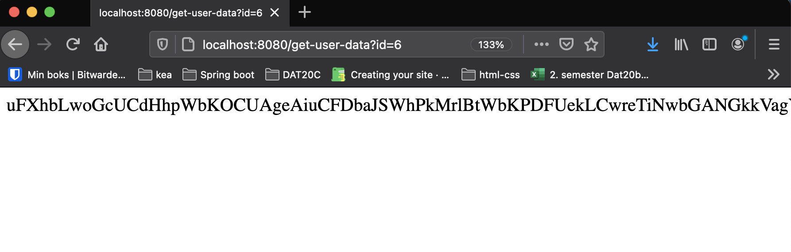

# Cache


## Introduction

When building websites its off course important that the website is fast. So what exactly makes a website slow? Lots of different thing, but fetching data from an api, getting data out of a database and just generally calls that takes a long time off course make a website slow. 

To fix that problem we can use a cache. A cache works by storing data in memory which is super fast. The process works like this 👇

```java
// Method for getting a users data
public UserData getUserData() {
  // First check if the users data is already in the cache
  if(usersCache.has(userId)) {
    // If the data for a user is the return that data
    // this call is super fast!
    return usersCache.get(userId);
  } else {
    // If the data for the user is not in the cache
    // Then we need to fetch that data
    // This call is super slow
    UserData userData = UserRepository.getDataFromDatabase(userId);
    // Now we set add the users data to the cache
    // so that next time we ask for that data we return it from the cache not the database!
    usersCache.set(userId, userData);
  }
}
```


Here is a great video explaining how a cache works

[](https://www.youtube.com/watch?v=n__c7xY1ZcI)


## Task

It is your job to create a `Cache` class. The underlying datat structure for storing the cache has to be a `HashMap`


The `Cache` class has to have these methods

| Method name       | Method description                                           |
| ----------------- | ------------------------------------------------------------ |
| `get(key)`        | Should retrun the value stored at the `key`                  |
| `set(key, value)` | Should add the `value` to the `key`                          |
| `has(key)`        | Should return a `Boolean` indicating if there is data for the `key` |
| `delete(key)`     | Should delete the `value` and the `key`                      |
| `setTTL(key)`     | *Optional!* Should set a time to live for that key.          |


### Time to live - *optional*

In order to control how long a key will stay in a cache we use time to live (TTL). This means that the value stored at a specific key will only be accessible for the TTL in seconds. 

```java
// Create a new Cache class
Cache userCache = new Cache();
// Store some data at a key (userId)
userCache.set(userId, "super long string");
// Set the TTL to 600 seconds (10 minutes)
userCache.setTTL(userId, 600);
```


If we wait 5 minutes and try and get the value at the `userId` we will get the value

```java
// Get the value for the key userId
userCache.get(userId); // "super long string"
```


If we wait 11 minutes and try and get the value at the `userId` we get `false`

```java
// Get the value for the key userId
userCache.get(userId); // false
```


## Practical example

```java
// Create a new Cache class
Cache userCache = new Cache();
// Getting a key before it is saved
userCache.has(userId); // false
// Store some data at a key (userId)
userCache.set(userId, "super long string");
userCache.has(userId); // true
// Get the value for the key userId
userCache.get(userId); // "super long string"
// delete the value for the key userId
userCache.delete(userId);
userCache.has(userId); // false
```


## Applying your newly created Cache

Create a `User` class with an `id` that is randomnly generated and the following method:

```java
// simulates a slow call
public String getDataSlow() throws InterruptedException {
    TimeUnit.SECONDS.sleep(10);
    String generatedString = RandomStringUtils.randomAlphabetic(1000);

    return generatedString;
}
```


Now create an endpoint that should be used like this: http://localhost:8080/get-user-data?userId=6

This should return the randomnly generated `value` stored for the user with `userId` 6



Remember to initialize the Cache in the controller. Then at a given endpoint

- First check if the key (userId) is there
- If it is, return the value
- If not, get the value using the slow method, then store the result in the cache


## Handing in your homework

This exercise has to be **handed in the 15/3**


Please create a new Github repository and add your code there. Submit the link for the Github repo. 

