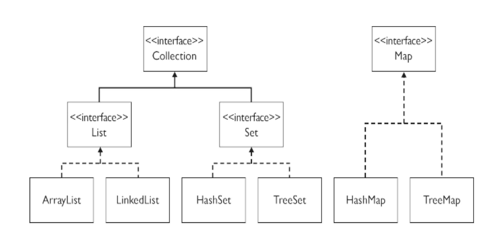

# Data structures

Knowing about different ways to store data is crucial when writing software. Right now it might not be that clear because you are working with small amounts of data in your projects. But once you start working with 1000 of objects, maybe even millions of objects then knowing different data structures is absolutely crucial. 


## Learning objectives

- `ArrayList`
- `Hashmap` - Collisions and extension
- `TreeSet`
- Identify which is best for which use case





## Specifying the ADT

It's a good practice to declare any variables and parameters of a collection type using the appropriate interface type for that ADT rather than the actual class's type. 

```java
List<String> names = new ArrayList<>();
```

This programming practice is “strongly recommended” because “it gives you the flexibility to change implementations.”


## List

Array structure where duplicate items are allowed. Get the item through using the index. Can be easily iterated. 


### Arraylist

Stores data in a list. You can `add`, `get`, `set` and `delete` items. Every item in the `ArrayList` has an index. 

We access data using the index of the item. 

A sequence of elements arranged in order of insertion


#### Pros

- Fast to get items at a specific index
- Adding and removing at the end of the list is fast


#### Cons

- Finding a specific item is slow. Since we need to search through every item in the array to find what we are looking for
- Deleting an item is slow. Especially if we need to remove an item in the front of the array. That is because for all the items at the index after the deleted item we need to update the index.


### LinkedList

Stores items just like `ArrayList` but does it in a different way


#### Pros

- Adding and removing at the end and front of the list is fast


#### Cons

- Finding a specific item is slow. Since we need to search through every item in the array to find what we are looking for
- Slow to get items at a specific index


Use `LinkedList` if you need to add or remove items in the start of your `List` then use `LinkedList`. BUT getting an item at a index takes `O(n)` time. Huge disadvantage. 


More in depth here: https://stackoverflow.com/questions/322715/when-to-use-linkedlist-over-arraylist-in-java


#### Typical `List` usages

- List of accounts
- List of numbers
- The lines of a file


## Map

A collection that associates objects called keys with objects called values. You can store a key/value pair into a map; later in your code, if you supply just the key to the map, it will give you back the value associated with that key. 


*Instructor note: code the above data structure* 👆


When creating a new `Map` we need to write it like this:

```java
Map<String, Double> salaryMap = new HashMap<>();
```

The `String` part indicate the type of the key. The `Integer` part indicates that the value will be stored as `Integer`. 


To add items to a `Map` we use the method `put`

```java
salaryMap.put("Stuart Reges", 10000.00);
```

Now to get the value we write:

```java
Double stuartSalary = salaryMap.get("Stuart Reges");
```

*How would this use case have looked with `ArrayList`?*


The Java hashmap has a lot of operations, but for this note we will only look at a few of them:

- `put(K key, V value)` - Associates the specified value with the specified key in this map.
- `get(Object key)` - Returns the value to which the specified key is mapped, or null if this map contains no mapping for the key.
- `containsKey(Object key)` - Returns true if this map contains a mapping for the specified key.


#### Pros

- Fast to remove or add any item
- Fast for finding items


#### Cons

- Has got no index for finding items
- Iterating through the items is hard


#### Typical `Map` usages

- Word counting
- Phone book creation


### TreeMap

A `HashMap` where the keys are sorted.


### Hashmap

More efficient than a `TreeMap`. So if order does not matters to you then use a `HashMap`.


### HashMap exercises - 30 min

Using this boilerplate: https://github.com/behu-kea/data-structure-exercise-boilerplate

In the [`HashMapExercise` class](https://github.com/behu-kea/data-structure-exercise-boilerplate/blob/master/src/main/java/HashMapExercise.java) you should finish the method called `contains3`. This method takes a `List` of strings as parameter and returns `true` if there in the list is a string that occurs at least 3 times. otherwise return `false`.  Use `Map` as a data structure, which `Map` implementation will you use?

See the usage i the `Main.java` class. Here the code that calls the method with random strings (dishes) has been created for you. 

Here is a practical example of how the method should work

```java
List<String> words1 = new ArrayList<>();
words.add("chicken");
words.add("chicken");
words.add("house");
words.add("chicken");
HashMapExercise.contains3(words); // returns true

List<String> words2 = new ArrayList<>();
words2.add("chicken");
words2.add("house");
words2.add("chicken");
HashMapExercise.contains3(words2); // returns false
```


Pseudo kode til opgaven

```
Lav et map-objekt
Loop igennem listen
For hvert element 
	If( jeg har ikke set elementet før) 
		map.put(element, 1) 
	Else (jeg har set elementet før) 
		Int antal = map.get(element) 
		antal++ 
 		map.put.(element, antal) 
```


## Set

`Set` data structures cannot contain duplicates! 


```java
Set<String> stooges = new TreeSet<String>();
stooges.add("Larry");
stooges.add("Moe");
stooges.add("Curly");
stooges.add("Moe"); // duplicate, won't be added
stooges.add("Shemp");
stooges.add("Moe"); // duplicate, won't be added
```


#### Set operations

| **Set operation** | **Method**  | **Description**                               |
| ----------------- | ----------- | --------------------------------------------- |
| union             | `addAll`    | Set of all elements that are in A, B, or both |
| intersection      | `retainAll` | Set of all elements that are in both A and B  |
| difference        | `removeAll` | Set of all elements that are i A but not in B |


*Make an example with some sets of names*


#### Pros

- Cannot contain dublicates
- Fast for searching (`contains`)
- Items are sorted when added
- Really good for doing set operations (union, intersection, etc.) shown above!


#### Cons

- Cannot loop over using index (must use iterator)
- Does not have indexes


#### Typical `Set` usages

- Unique words in a book
- Lottery ticket numbers


### TreeSet

The list is sorted when the you add items! Adding items is a bit slower compared to `HashSet`. If you need a sorted list choose `TreeSet` otherwise choose `HashSet`


### Hashset

The list is not sorted when the you add items! Meaning adding items is quicker but sorting the list will be slow.


There are [other differences](https://stackoverflow.com/questions/25602382/java-hashset-vs-treeset-when-should-i-use-over-the-other) between `HashSet` and `TreeSet`


### Set exercises - 30 min

Using this boilerplate: https://github.com/behu-kea/data-structure-exercise-boilerplate

Using the `Set` data structure and the `randomNames1` and `randomNames2` figure out 

- How many names are in both `randomNames1` and `randomNames2`
- Log out the names that are in `randomNames1` but not in `randomNames2`
- Log out all the names in the two arrays


## Iterating the data structures

Iteration is different for most ADT's (Abstract Data Types) like `List`, `Map`, `Tree`. You can figure out how to iterate by googling: `YOUR_DATA_STRUCTURE iteration` fx `TreeSet iteration`


## Which data structure to choose?


| Java class                          | elements in order | insert    | add                         | find                 | delete                            |
| ----------------------------------- | ----------------- | --------- | --------------------------- | -------------------- | --------------------------------- |
| ArrayList                           | true              | O(n)      | O(1)                        | O(n) (unless sorted) | O(1) if last, O(n) in general.    |
| LinkedList                          | true              | O(n)      | O(1) if added in either end | O(n)                 | O(n) in the middle, O(1) at ends. |
| HashMap                             | false             | O(1)      | O(1)                        | O(1)                 | O(1)                              |
| TreeMap                             | true              | O(log(n)) | O(log(n))                   | O(log(n))            | O(log(n))                         |
| Sets (like list, but no dublicates) | false             | O(1)      | O(1)                        | O(1)                 | O(1)                              |
| Array                               | true              | -         | -                           | O(n)                 | -                                 |


👉 The two datastructures which will cover 90% of your needs are **ArrayList** and **HashMap**. 👈


## Exercise - Rest of class


### System for Storebæltsbroen

We have been asked to build a system for Storebæltsbroen. They want to build a system that can keep track of all the cars that cross the bridge. They have built some software for recognising numberplates, car color, number of passengers and length. The information about a car should be saved using the numberplate. 

The information they want to save for a car is the following:

- Car color
- Number of passengers
- Car length

It is important for Storebæltsbroen that they can **quickly** find information about a particular car (using the numberplate)

What data structure should we choose and why? Write a bit of code (maybe pseudo code) showing how you would save some data for a new car.


#### Continued

Storebæltsbroen (the company) owns more bridges and they would like to know how many of the cars has been crossing **all** of the bridges. From each bridge they register the numberplate using the above mentioned system. The system should be **fast**. What data structure can help us achieve this and why? Please write some pseudo code of how you would get how many of the cars has crossed **all** the bridges


### More exercises

1. Imagine a method which will get an array of Strings, each String will contain just one word. You need to answer how many different words are there in the array. Which collection is well suited for this?

   For example: ["up","down","ip","a","a", "up", "down"] will return 4 (up, down, ip, a).

---

2. This time you will still read the same file, but afterwards you are asked to write out how many times each word occured in the list. Which collection is well suited for this?

   For example: ["up","down","ip","a","a", "up", "down"] will print "up: 2, down: 2, ip: 1, a: 2 

---


#### Alice in Wonderland

##### Map

1. Skriv en metode der hedder `aliceInWonderland` som indlæser filen [aliceInWonderland](https://github.com/behu-kea/dat20-classes/blob/master/week-10/assets/Alice%20in%20wonderland)  og printer et map med følgende Key/value pair 

	- Key: Unikke ord i bogen 
	- Value: Hvor mange gange det optræder 

Brug et map som datastruktur. 

Pseudokode til opgaven

```
Lav et map-objekt 
Loop igennem listen 
For hvert element 
	If( jeg har ikke set elementet før) 
		map.put(element, 1) 
	Else (jeg har set elementet før) 
		Int antal = map.get(element) 
		antal++ 
 		map.put.(element, antal) 
```

 

2.  Skriv en metode der hedder `aliceMostFrequent` som indlæser filen  aliceInWonderland og returnerer hvor mange gange det hyppigst optrædende ord forekommer. Brug en map som datastruktur. 


##### Set

1. Skriv en metode der hedder `uniqueAlice` som indlæser filen [aliceInWonderland](https://github.com/behu-kea/dat20-classes/blob/master/week-10/assets/Alice%20in%20wonderland) og returnerer og returnerer hvor mange unikke ord den indeholder.  Brug et set som datastruktur. 

2. Skriv en metode der hedder countCommon som tager to lister af Integers som  parametre og som returnerer antallet af unikke tal der findes i begge lister. Brug et eller flere set til at løse dette.  

   ​	eksempel: hvis den ene liste indeholder værdierne { 3, 7, 3, -1, 2,3 7,  2, 15, 15} og den anden liste indeholder værdierne {-5, 15, 2, -1, 7,  15, 36} skal metoden returnere 4 fordi elementerne -1, 2, 7 og 15  forekommer i begge lister.

