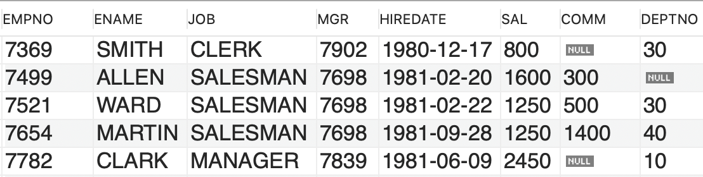

# SQL continued


## Before we start

- Last class with you
- Feedback on Social media
- Cache exercise


Using the relational part of SQL is a big part of working with databases. Having Reviews connected to Products or employees that belong to a department. 


## Learning goals

- Can use `UPDATE`
- Can use `DELETE`
- Knows about relations in the database model (`PK`, `FK`, `NULL`)
- Can use `JOIN`


## `UPDATE`

To update an existing row in the database use the `update` SQL command


```sql
UPDATE product SET price = 23, name = "candy" WHERE id = 1;
```

What do you think happen if we run this command: 

```sql
UPDATE product SET price = 23;
```


## `DELETE`

To delete a row use the `DELETE` SQL command

```sql
DELETE FROM product WHERE id = 1;
```


## Relations


### Primary key

The `PRIMARY KEY` constraint uniquely identifies each record in a table. Hwy do we need that?

Moreover, this identifier will automatically increment every time data is inserted. `id` is called the primary key of the table `product`.


```sql
CREATE TABLE product (	
  id INT NOT NULL AUTO_INCREMENT,
	price INT, 
	name VARCHAR(30), 
	description VARCHAR(255),
  PRIMARY KEY (id)
); 
```

`NOT NULL` - You can add `NOT NULL` after your column. This tells SQL that the column has to be included when a new row is created. Is called a constraint

`PRIMARY KEY (id),` - means that the column called `id` has to be unique

`AUTO_INCREMENT` - When creating a new row the `id` does not have to be part of the insert statement. 


### Foreign key

Foreign keys are used to tell SQL that a column is connected to another column in another table. 


```sql
CREATE TABLE product (	
  id INT NOT NULL AUTO_INCREMENT,
	price INT, 
	name VARCHAR(30), 
	description VARCHAR(255),
  review_id INT,
  PRIMARY KEY (id),
  FOREIGN KEY (review_id) REFERENCES review(id)
); 
```


```sql
CREATE TABLE review (	
  id INT NOT NULL PRIMARY KEY AUTO_INCREMENT,
	text VARCHAR(255), 
  PRIMARY KEY (id),
); 
```


 ### Exercises - 40 min with break

Jeg vil rigtig gerne have noget feedback på min undervisning, så brug lige 5 - 10 min på at udfylde den her form (2 spørgsmål): https://forms.office.com/r/CMKckUQQwD


Use your social media database from last week for the following exercises. Or use [this sql script](https://github.com/behu-kea/dat20-classes/blob/dat20b/week-11/assets/social-media-database.sql) to create the `post` table with some posts


#### `UPDATE`

To make this work use: 

`SET SQL_SAFE_UPDATES = 0;` or 

Hvis i har problemer med updates så

Preferences -> sql-editor -> safe updates skal aftjekkes! Genstart workbench bagefter


Update some of the rows in the `post` table. Try updating both a single row and multiple rows with one SQL command


#### `DELETE`

Try deleting some rows.  Try deleting both a single row and multiple rows with one SQL command


#### `PRIMARY KEY` og `FOREIGN KEY`

In the exercise below you have to change the `post` table. So i would encourage you to create a new database called `social-media-database-improved` with the changes i describe below

Change the `post` table so that

- `id` is a  `PRIMARY KEY`
- When creating a new `post` row `id` is mandatory
- `id` should be automatically incremented when creating a new `post` row


Let's imagine we can add an image to a `post`

An image has these columns:

- Id
- Image url
- Description
- Title


1. Create the `image` table and create a foreign key in the `post` table so that a post can reference an image.

2. Now insert a few images and create some posts that are connected to an image
3. What if we wanted to store multiple images for a post? This is a tricky question. Read up on it here: https://stackoverflow.com/questions/7296846/how-to-implement-one-to-one-one-to-many-and-many-to-many-relationships-while-de


## Joins

To get data from two different tables we need use joins. Joins will combine two table into one table that can then be queried. 

Lets imagine we have to find out the location for all the employeers workplace. More specifically we would like to select the column `ENAME` from the table `EMP` with the column `LOC` from the `DEPT` table. This means we have to use a join!


Using the tables below lets try ourselves manually and make the join table!


**EMP**




**DEPT**


### Inner join

Only merge the rows where there is a match. In the example below: Only merge rows where the employees `DEPTNO` matches a departments `DEPTNO`

```sql
SELECT EMP.ENAME, DEPT.LOC
from EMP
INNER JOIN DEPT ON EMP.DEPTNO = DEPT.DEPTNO;
```


### Left join

Keep all the records in the left table (`EMP`). Records that dont match get `null` values

```sql
SELECT EMP.ENAME, DEPT.LOC
from EMP
LEFT JOIN DEPT ON EMP.DEPTNO = DEPT.DEPTNO;
```


### Right join

Keep all the records in the right table (`DEPT`). Records that dont match get `null` values

```sql
SELECT EMP.ENAME, DEPT.LOC
from EMP
RIGHT JOIN DEPT ON EMP.DEPTNO = DEPT.DEPTNO;
```


## Reading an ER diagram

Not too much here, you will have about it later

Create an ER diagram in MySQL workench

`database -> Reverse engineer -> continue -> continue -> Select the database then continue -> continue -> execute -> continue -> exit` 


## Exercises

We will be working with the coffee-database for today's exercises. Find the script to create the database [here](https://github.com/behu-kea/dat20-classes/blob/master/week-11/assets/coffee-database.sql)

First study the diagram and get an overview of the data that is stored in the database. Take a look at the rows in the different table. 

Try and answer these questions:

- Can i create a customer without creating an order?
- If i wanted to create a new order how could i do that?
- How are the product table and the order table connected?
- How do i connect a country with a product?
- Does a product has to have a country?
- How can i get from the product table to the customer?


### Join exercises

- Select the order_table id and the customers phone number for all orders of product id 3
- Select product names and order time for the espresso coffees sold between January 15th 2017 and February 14th 2017
- Select the product name and price and order time for all orders from females in January 2017
- From the customers table, select the first name and phone number of all the females who have a last name of Bluth ([sheeeeiiittt](https://www.youtube.com/watch?v=l1dnqKGuezo) this exercise is a little creppy 😮) I did not come up with this one!
- From the products table, select the name for all products that have a price greater than 3.00 or a coffee origin of Sri Lanka
- How many male customers don't have a phone number entered into the customers table
- From the products table, select the name and price of all produts with a coffee origin equal to Colombia or indonesia. Ordered by name from A-Z
- From the orders table, select all the orders from February 2017 for customers with id's or 2, 4, 6 or 8
- From the customers tabl, select the firs name and phone number of all customers who's last anem contains the pattern "ar"
- From the customers table, select the distinct last names and order alphabetically from A-Z
- From the orders table, select the first 3 orders placed by customer with id 1 in February 2017
- From the products table, select the name, price and cofee origin but rename the price to retail_price in the results set


## Mangler

- Social media sql script with the post table and some rows