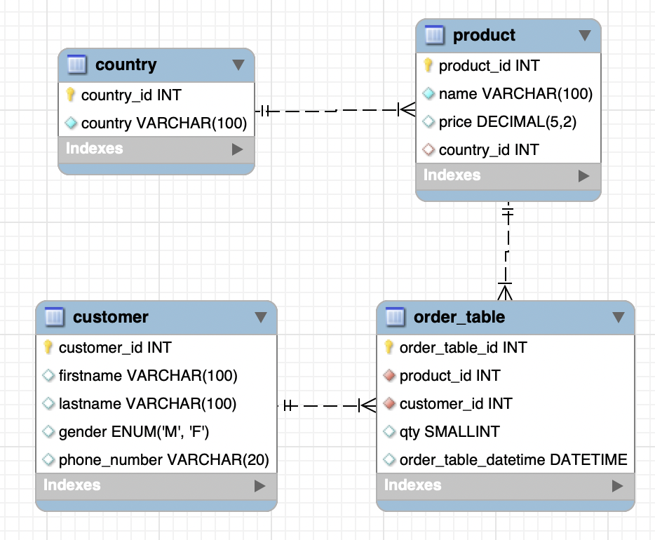

# SQL continued

Using the relational part of SQL is a big part of working with databases. Having Reviews connected to Products or employees that belong to a department. 


## Learning goals

- Can use `UPDATE`
- Can use `DELETE`
- Knows about relations in the database model (`PK`, `FK`, `NULL`)
- Can use `JOIN`


## `UPDATE`

To update an existing row in the database use the `update` SQL command


```sql
UPDATE product SET price = 23, name = "candy" WHERE id = 1;
```

What do you think happen if we run this command: 

```sql
UPDATE product SET price = 23;
```


## `DELETE`

To delete a row use the `DELETE` SQL command

```sql
DELETE FROM product WHERE id = 1;
```


## Relations


### Primary key

The `PRIMARY KEY` constraint uniquely identifies each record in a table

Moreover, this identifier will automatically increment every time data is inserted. `id` is called the primary key of the table `product`.


```sql
CREATE TABLE product (	
  id INT NOT NULL AUTO_INCREMENT,
	price INT, 
	name VARCHAR(30), 
	description VARCHAR(255),
  PRIMARY KEY (id),
); 
```

`NOT NULL` - You can add `NOT NULL` after your column. This tells SQL that the column has to be included when a new row is created. Is called a constraint

`PRIMARY KEY (id),` - means that the column called `id` has to be unique

`AUTO_increment` - When creating a new row the `id` does not have to be part of the insert statement. 


### Foreign key

Foreign keys are used to tell SQL that a column is connected to another column in another table. 


```sql
CREATE TABLE product (	
  id INT NOT NULL AUTO_INCREMENT,
	price INT, 
	name VARCHAR(30), 
	description VARCHAR(255),
  review_id INT,
  PRIMARY KEY (id),
  review_id FOREIGN KEY REFERENCES review(id)
); 
```


```sql
CREATE TABLE review (	
  id INT NOT NULL PRIMARY KEY AUTO_INCREMENT,
	text VARCHAR(255), 
  PRIMARY KEY (id),
); 
```


 ### Exercises - 40 min

Jeg vil rigtig gerne have noget feedback på min undervisning, så brug lige 5 - 10 min på at udfylde den her form (2 spørgsmål): https://forms.office.com/r/CMKckUQQwD


#### `UPDATE`

Brug jeres social media database fra sidste uge til at opdatere nogle af jeres rækker. Prøv både at opdatere enkelte rækker, og flere rækker med en SQL command


#### `DELETE`

Prøv at slette nogle rækker i social media databasen. Prøv både at slette enkelte rækker og flere rækker med en SQL command


#### `PRIMARY KEY` og `FOREIGN KEY`

I den her opgave skal i ændre i databasen. Derfor bliver i nødt til at slette database og lave den på ny (med de ændringer jeg beskriver herunder)

I skal ændre `post` tabellen fra sidste uge sådan at:

-  `id` skal være `PRIMARY KEY`, 
- Gør sådan at man **skal have** et `id` når man tilføjer en ny række i `post` databasen
-  gør sådan at databasen automatisk incrementerer `id`'et i `post` tabellen


Let's imagine we can add an image to a `post`

An image has these columns:

- Image url
- Description
- Title


Create the `image` table and create a foreign key in the `post` database so that an post can reference an image


## Joins

To get data from two different tables we need use joins. Joins will combine two table into one table that can then be queried. 

Lets imagine we have to find out the location for all the employeers workplace. More specifically we would like to select the column `ENAME` from the table `EMP` with the column `LOC` from the `DEPT` table. This means we have to use a join!


Using the tables below lets try ourselves manually and make the join table!


**EMP**


**DEPT**


### Inner join

Only merge the rows where there is a match. In the example below: Only merge rows where the employees `DEPTNO` matches a departments `DEPTNO`.

```sql
SELECT EMP.ENAME, DEPT.LOC
from EMP
INNER JOIN DEPT ON EMP.DEPTNO = DEPT.DEPTNO;
```


### Left join

Keep all the records in the left table (`EMP`). Records that dont match get `null` values.

```sql
SELECT EMP.ENAME, DEPT.LOC
from EMP
LEFT JOIN DEPT ON EMP.DEPTNO = DEPT.DEPTNO;
```


### Right join

Keep all the records in the right table (`DEPT`). Records that dont match get `null` values.

```sql
SELECT EMP.ENAME, DEPT.LOC
from EMP
RIGHT JOIN DEPT ON EMP.DEPTNO = DEPT.DEPTNO;
```


## Exercises

We will be working with this database for today


