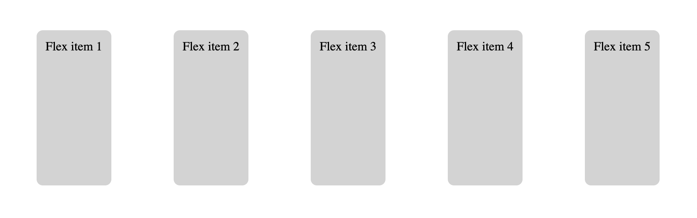
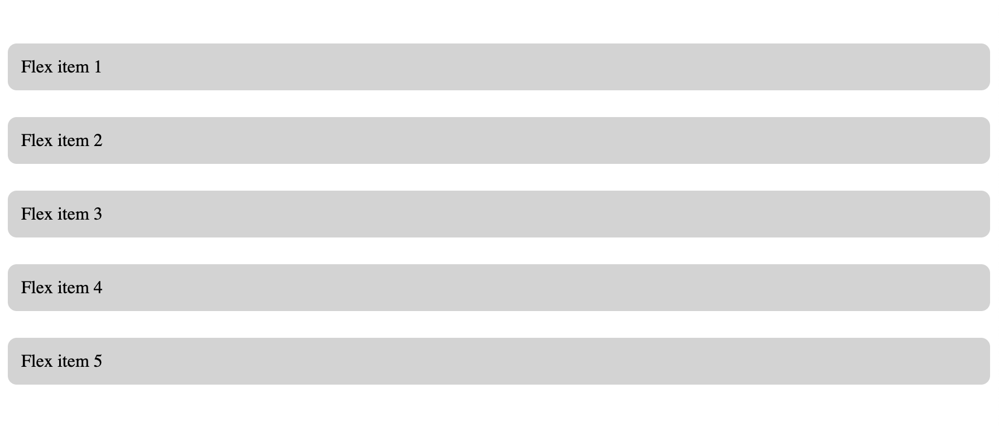

# CSS

This document can be found online here: https://behu.gitbook.io/kea/week-7/css


## Why are we even talking about html?

CSS bliver brugt til at style en hjemmeside. HTML er selve strukturen og indholdet. CSS er farverne, layout, animationer, skrifttyper etc. 


**D**

- Obligatorisk opgave Cache forklar! 
- Jeg har tilføjet learning goals til sidste uges html.


## Learning objectives

- Adding css to a site
- CSS selectors, properties and values
- CSS layout
  - Flow
  - Positioning
  - Flexbox


## What is css?

CSS stands for cascading style sheets.  It means the styles that are added for an element cascades down to their children. Its like a waterfall where the water will continue cascading down affecting the pools below. 

Lets see a concrete example of that! 


## Adding css to your site

Create a css file. Fx `main.css`. To add the css to your html, add this line in the `head` of your html: `<link rel="stylesheet" href="main.css">`. Now the css file called `main.css` is connected to the html. 

```html
<head>
    <link rel="stylesheet" href="main.css">
</head>
```


## CSS selectors and properties

CSS has three parts:

1. The selector - specifies what html elements to style
2. The property - specifies what sproperty we are changing (`color`, `width`, `font-size`)
3. Value - The value of the property. `20px`, `red` etc.


It goes kind of like this: First we find the elements to style (the selector) then we tell how those selected elements should be be styled. Here is an example:

```css
h1 {
    color: red;
}
```

 This reads like this: Select the `h1` html element. Now color the text red.

Lets go into more css selector details:


### CSS selector

#### Tag selector

Select all elements based on their tag name. Simply write the tag name 


This selector

```css
h1 {
    color: red;
}
```

Would color the text `Hello` red  `<h1>Hello</h1>`

```css
li {
    background-color: yellow;
}
```

Would give the `li` a yellow background color  `<li>List item</li>`


#### Id selector

For id selectors use `#`

```css
#congratulation-message {
    background-color: red;
}
```

Will select an element like this:

`<div id="congratulation-message">Congratulations 🎉</div>`


#### Class selector

For class selectors use `.`

```css
.user-name {
    font-weight: bold;
}
```

Will select an element like this:

`<div class="user-name">Charlotte123</div>`


#### Descendant selector

You can make the selectors more specific by using the descendant selector:

```css
.intro h1 {
    font-size: 25px;
}
```

Style all `h1` elements that are descendants of the element with class name intro

```html
section class="intro">
    <h1>Welcome to our wonderful site</h1>
</section>
```

You can also formulate it differently:

First find all the elements with a class of intro. Then find all the h1 tags that is descendants of the element with class intro. 


#### And selector

Use the comma

```
section.intro, h1 {
    font-size: 25px;
}
```

Now you would give the section with class name intro **and** the `h1` a font size of 25 pixel. 


#### Pseudo selector

use the `:`

```
.user-name:hover {
    color: purple;
}
```

Give the element with class user-name a color of purple when hovered with the mouse


There are **a lot** more but these are the most important ones. You can find more here: https://developer.mozilla.org/en-US/docs/Web/CSS/Reference#selectors


*Exercise - selecting elements - 20 min*

https://flukeout.github.io/

Hopefully we can do it as pair programming exercise. One drives, one supports. 

The driver shares his/her screen. Halfway switch. 

The html tags are not standard html tags like `div`, `p` and `section`. But the concept of selecting is the same. 


## CSS properties

https://developer.mozilla.org/en-US/docs/Web/CSS/Reference

A property in css is the styling you want to apply to an element. You write a property with the property name then `:` and then the value.


*Exercise* - 10 min

Give the button with the text `Signup` a `green` background color

All buttons in the page should have a padding of `12px` and a rounded corners

```html
<body>
    <main>
        <section class="intro">
            <h1>Welcome to my site</h1>
            <h2>I hope you like it</h2>
            <button class="call-to-action">Signup</button>
            <button>See pricing</button>
        </section>
    </main>
</body>
```


## CSS layout

CSS layouting is hard!

CSS layouting decides how elements are layouts. What comes on top/to the left of what. 


### Flow

CSS flow decides how  elements are layed out. The flow can be changed with the `display` css property *show*. 


#### Block flow

Elements that have block flow are stacked on top of each other. 

These elements are fx `div`, `p`, `section`, `footer`

*Teacher note:* Show with example


#### Inline flow

Elements that have inline flow are positioned next to each other. 

That if fx `span`, `a`, `strong`

*Teacher note:* Show with example


### Positioning

#### Relative

Position an element **relative** to its original position. 

```css
section .user-name {
    display: relative;
    left: 10px;
}
```


#### Absolute

Position an element in relation to the first parent that has a position set as a property. Text on top of and in the middle of an image. 

```css
section .user-name {
    display: absolute;
    left: 10px;
}
```

Exercise: https://www.w3schools.com/css/exercise.asp?filename=exercise_positioning5


#### Fixed

A fixed element always appear at the same place on the screen no matter of someone scrolls! Imagine a cookie accept box. 

```css
section .user-name {
    display: fixed;
    left: 10px;
}
```


### Flex

Flex is a relative new way of layouting things in the browser. 


#### Flex container

Is where the `display: flex;` is applied. This will make all the **immediate children** flex items.  

```html
<div class="flex-container">
    <div>Flex item 1</div>
    <div>Flex item 2</div>
    <div>Flex item 3</div>
    <div>Flex item 4</div>
    <div>Flex item 5</div>
</div>
```

When applying `display:flex;` the default direction of the flex items is row, meaning they will be positioned next to each other. 

We can use the `justfy-content` to decide the spacing between the element in the flex direction. We can use `align-items` to decide the spacing in the other direction. 

Now try and play around with `flex-direction` and with `justify-content` and `align-items`

https://marina-ferreira.github.io/tutorials/css/flexbox/

https://css-tricks.com/snippets/css/a-guide-to-flexbox/

*Practical example*


#### Flex exercies

Using Flex, recreate the following mockups using the html above with the `flex-container`






## Bootstrap

Bootstrap is a css framework that helps you develop nice layouts and styling quickly. It basiscally works by adding specific elements with specific Bootstrap classes. 

https://getbootstrap.com


## How to deconstruct a layout

https://www.amsiq.com/da


## *Exercise*

Try and recreate the layout below with the code found [here](https://github.com/behu-kea/dat20-classes/tree/master/week-1/exercises/flexbox). You can clone the project and open the files in IntelliJ or just copy the files to your computer. Thats up to you. 


## Working with the inspector

You can see the css for any element on the web. Right click on the element and choose inspect element. 


on the right hand side you can see the styles applied to the element you have inspected. In the `element` panel you can write your own css rules!


## Exercise - Style your portfolio

Style your portfolio! 

We want to see you doing some layouting on your portfolio. How you do the layouting is up to you! You can use flex, Bootstrap or whatever you feel like. 


#### CSS checklist

- [ ] Is the css imported using the style tag.
- [ ] Are there unused selectors.
- [ ] Are there lots of fixed pixel values. This could affect responsive layouts.
- [ ] Try to avoid absolute positioning as this tends to break responsive layouts.
- [ ] Use flexbox over floats.
- [ ] Avoid using `!important` statements.
- [ ] Avoid inline styles
- [ ] Consistent naming and grouping of css-classes (see naming conventions below)
- [ ] CSS selectors are only as specific as they need to be


## If you want to continue learning

- Responsive
  - Mobile first
  - Media queries
- Animation
- Boxmodel
- Grid
- Floating
- Specificity

- External, inline element styles