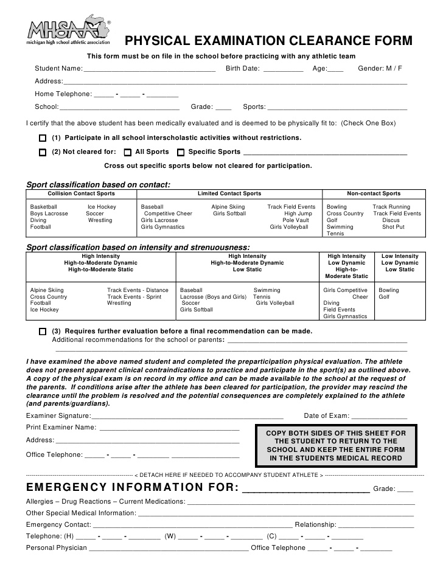
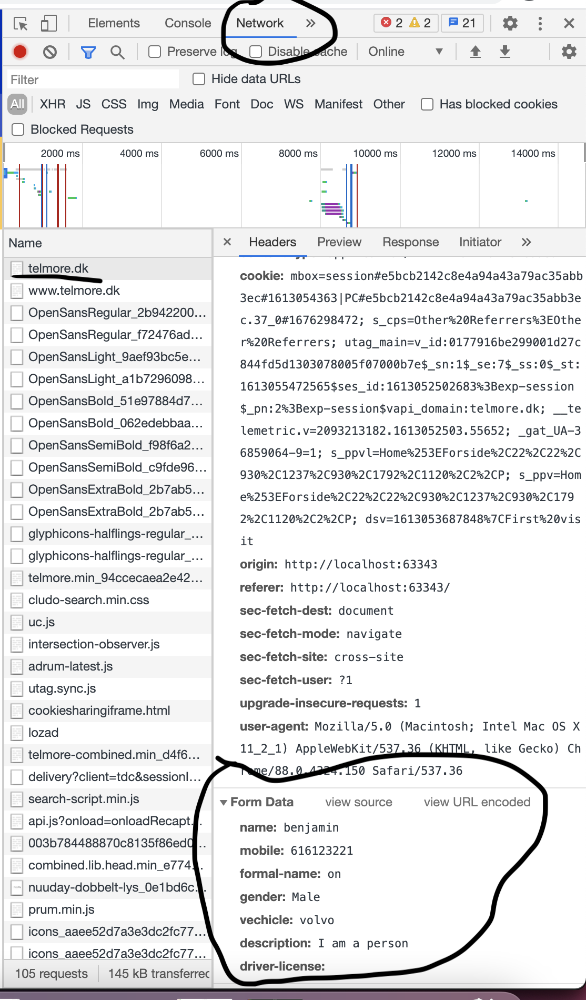

# Forms, post and redirect

Go here for online version: https://behu.gitbook.io/kea/week-8/forms-post-redirect

## Why are we even talking about forms and post?

Sending data to a server is essential for interacting with a website user. Create a new user, booking online flight tickets, ordering a product online. 


## Learning goals

- HTML forms
- `@PostMapping`
- `redirect`
- PRG pattern


## HTML Forms

HTML forms is used for sending data to the server. it comes from physical forms like these:




## GET request vs POST request

There are quite a lot of different request types. We will focus on `GET` and `POST`:

- **GET request** - Getting information. Fx get all the information we have on the user with id 1. Or simply get the html at the `/about` url
- **POST request** - Creating new information. Fx creating a new user, making a new order, creating new facebook post. 


### Creating a form

Here is an example of a form

```html
<form action="/sign-up" method="POST">
    <input type="text" name="name"/>
    <input type="tel" name="mobile" />
    <input type="checkbox" name="formal-name"/>

    <button type="submit">Submit</button>
</form>
```

There are a few things going on. Lets disect it:

`action="https://telmore.dk"` - The `action` attribute decides what url the form data should be send to. 

`method="GET"` - The `method` attribute decides what kind of request to make. When posting we will mostly be using a `POST` request because we are creating a new user.

`<label for="mobile">Write your mobile</label>` This is a label that is connected to some field. It helps the user figuring out what to put into the connected field. The connection between `label` and field happens with the `for` attribute and the `id` on the field. 

`type="text"` -  `input` fields can have a type. There are quite a lot of [types](https://www.w3schools.com/html/html_form_input_types.asp). it can help the user and also do a bit of validation on the frontend. So fx if you specify `type="number"` then the number keyboard will come up on the users mobile. 

` name="mobile"` - When we send the data to a server, then name decides the key of that field. See below. Here is the `POST` request 





` button type="submit"` - When the button is clicked submit the form. 


#### Exercise

Create an html page with a form that can submit a new social media post. It should have these fields:

- Title
- Content (the text of the social media post)
- Date
- Public/private


Answer these two questions:

- If i wanted a `label` for my field how could i do that?
- What if i wanted a `placeholder` for my input?


##### Testing that your form works!

- Go to that website that visualizes your request: https://webhook.site

- Where it says **Your unique URL** copy the url and put that url into the  `action` attribute in the `form` you have created. 
- Now when you submit the form, you should be able to see the request coming in on the https://webhook.site. 
- In the bottom where it says `Raw Content` you should be able to see the data you sent (You should see title, content, date and public/private)


## PostMapping


Now we have figured out how to send the `POST` request (with data) to the server using forms. Now we need to figure out how to get that data in our `@controller`

```java
@PostMapping(value = "/sign-up")
@ResponseBody
public String createNewUser(@RequestParam("name") String name, @RequestParam("mobile") int age) {
    return "User created with name: " + name + " and mobile: " + mobile;
}
```

Using the `@PostMapping` notation we can use it just like the `@GetMapping` specifying a `value` that will be the endpoint. 

To get data out of the `POST` request use  `@RequestParam("name") String name`. `@RequestParam` specifies the key  you are looking for. Remember that the `name` attribute on the field decided the key!


## Redirect

Some times we are interested in making the user go to another website than the one he put in the url or was directed to. For this we use forwards and redirects

Using the redirect prefix we can redirect to another page: `redirect:/URL_TO_REDIRECT_TO`

```java
// Redirect with prefix redirect
@GetMapping("redirect-prefix-test-simple")
public String redirectViewPrefixSimple() {
    // adding query parameters to the redirected page
    return new String("redirect:/sign-up");
}
```


Using query parameters

```java
// Redirect with prefix redirect
@GetMapping("redirect-prefix-test")
public ModelAndView redirectViewprefix(ModelMap model) {
    // adding query parameters to the redirected page
    model.addAttribute("name", "Louise");
    return new ModelAndView("redirect:/sign-up", model);
}
```


#### Redirect behind the scenes

Below is how the redirect will work behind the scenes. What does the 302 mean? 


So the redirect says : "Hey browser i have actually moved this url by sending the  `302` response code". 

Now the browser asks: "Sound good server, but where have you moved the url to???". 

The server responds: "Just look at the `response header` called `Location`. Thats where the url has been moved to!". 

The browser now loads the new url found under the `Location` header!


## Post, redirect, get pattern

Imagine a user submits a form and reloads the page. Now that form request will be sent twice. Resulting in two database instances.

With this new pattern a server receives a request, saves the data (`createProduct`) and then redirects the user to a confirmation page using `GET` not `POST` (`createProductPageSuccess`)

 

```java
@Controller
public class PostRedirectGet {
    @GetMapping("create-product")
    public String createProductPage() {
        return "create-new-product";
    }

    @PostMapping("create-product")
    public String createProduct(@RequestParam String title, @RequestParam int price, RedirectAttributes attributes) {
        attributes.addAttribute("title", title);
        attributes.addAttribute("price", price);

        return "redirect:/create-product-success";
    }

    @GetMapping("create-product-success")
    @ResponseBody
    public String createProductPageSuccess(@RequestParam String title, @RequestParam int price) {
        return "Created product: " + title + " " + price;
    }
}
```

Notice how the `POST` parameters are sent to the `create-product-success` using `RedirectAttributes`.


## Exercise time 🎉 

We would like to create a new social media! 

Therefore create a website where users can create a new social media post and see a list of all posts that were created. Use this repo as a starter for your project: https://github.com/behu-kea/new-social-media

The site should have these url's:

| Url          | Description                                                  |
| ------------ | ------------------------------------------------------------ |
| `/submit`    | Is where a user can create a new social media post using a `form`. Use the  `form` you created in the exercise earlier. In the starter there is an example of how to return an html template for a specific route. |
| `/dashboard` | Return the json for all the public social media posts (Thursday we will render these posts using html templates). In the starter example there is an example of how to return json from a list. |


This is what a post should include

- Title
- Content
- Date
- Public/private
- Something that you come up with!


To give this new social media a bit of edge, add something to the social media post. 

Maybe it's a site for dog lovers, so you add Dog name to the post

Maybe its a Dice lovers so you add their favorite dice number from 1-6

I would love to see a bit of creativity here :) 


Focus on creating the post, sending the post and doing the redirects. Thursday we will focus on creating the html templates and rendering the different pages. 