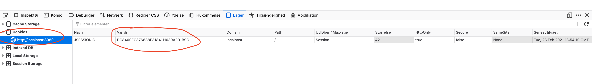

# Sessions


## Before we start

Frustrerende semester, der er rigtigt meget der bliver smidt efter jeg som studerende!

Added folder structure


## So why are we talking about session?

Sometimes we need to save data for a user. When you log in to fx Facebook and next time you visit facebook you dont need to log in again. That is solved using sessions.


## Learning objectives

- What is a session and why do we use it?
- Implementing session for spring boot
- Rendering sessions using Thymeleaf


## Sessions

When developing web applications sometimes we need to store data for a user. That could fx be to save data for a logged in user. It could also be to store previous searches from a user like Google maps does. 

Now the problem with that is that HTTP is stateless. This means that there is no state stored in a request. Each request is a completely new request.

This problem is solved using sessions. 


### Creating a session in Spring boot

Firstly add the dependency that makes the sessions work:

```xml
<dependency>
    <groupId>org.springframework.session</groupId>
    <artifactId>spring-session-core</artifactId>
</dependency>
```


For creating the session in Spring boot we will be working with two specific classes:

- `HttpServletRequest` - Represents the request. It lives from the controller receives the request to a response is sent to the browser. Once the `request` object has been responded, the `request` object will be deleted. Said another way: The request scope ends when the associated response is finished.
- `HttpSession` - The session lives across multiple requests. The session scope ends when the session has been timed out by the client or server. 


Let's get to a real example:

```java
@GetMapping("/set-session")
@ResponseBody
public String setSession(HttpServletRequest request) {
    HttpSession session = request.getSession();
    session.setAttribute("username", "CookieMonster42");
  
    return "Username saved in the session";
}

@GetMapping("/get-session")
@ResponseBody
public String getSession(HttpServletRequest request) {
    HttpSession session = request.getSession();
    String username = (String) session.getAttribute("username");
  
    return username;
}

@GetMapping("/invalidate-session")
@ResponseBody
public String invalidateSession(HttpServletRequest request) {
    HttpSession session = request.getSession();
  	session.invalidate();

  	return "Session invalidated";
}
```

Lets disect what happens here:

There are 3 endpoints

1. `/set-session` - Here we save the value (`"CookieMonster42"`) that is stored under the key `"username"`
2. `/get-session` - Here we get the value stored under the `"username"` key
3. `/invalidate-session` - Here we invalidate (delete) the session


Let's dive into some of the code

- `request.getSession() ` to get the session we use the `getSession` method on the `request`

- `session.setAttribute("key", "value")` - Will save some data in the session. It will be in a key value format. Save this value at this key

- `session.getAttribute("key")` - Will get some value at the specified key
- `session.invalidate()` will invalidate/delete the session


### What can i save?

Anything you would like! `String`, `Integer`, `ArrayList`, some class it does not matter!


```java
@GetMapping("/set-users")
@ResponseBody
public String setSession(HttpServletRequest request) {
    HttpSession session = request.getSession();
    ArrayList<User> users = new ArrayList<>();
    User user1 = new User("benjamin", 23);
    User user2 = new User("peter", 45);
    users.add(user1);
    users.add(user2);
    session.setAttribute("users", users);

    return "two users saved in the session";
}

@GetMapping("/get-session")
@ResponseBody
public String getSession(HttpServletRequest request) {
  HttpSession session = request.getSession();
  List<User> users = (List<User>) session.getAttribute("users");

  return username.get(0).name;
}
```


## So how does session actually work - Cookies

*Learning about cookies is not part of the learning goals!*

In Spring boot sessions is implemented using cookies. Cookies is a small text file saved in the browser. This small text file gives the user an id so it knows who you are! Now every time you request a page from a specific domain, the `cookie` is sent with the request. Now the server know who requested a specific page.


Here is a screenshot of how the cookie is stored in the browser




Here is a screenshot of how the cookie id is sent in the request


## Sessions in Thymeleaf

To access the session in Thymeleaf simply use the `session`. We dont need to send the session from the `@Controller` to the view. 


```java
@GetMapping("/get-session-rendered")
public String getSessionRendered() {
    return "session.html";
}
```


**session.html**

```html
<div th:text="${session.username}">John Doe</div>
```


Since the sessions might not be there, its a good idea to check if they session data is available first:

```html
<div th:if="${session.containsKey('username')}" th:text="${session.email}"></div>
```


We can also use `session.size()` and `session.isEmpty()`


## Exercise - 40 min

Study this code in groups of 2 or 3: https://github.com/behu-kea/notes-example/ 


Figure out:

- How is the controller structured?
- What endpoints are there and what do those endpoint do?
- How does the template work?
- How is the session used?


Answer these questions:

- What type are the notes?
- How are the notes saved in the session
- We are not sending any data from the controller to the view. How are we rendering the notes?
- When clicking the `Add Note` button a new note is saved in the session. But how does that work?


When you come back i will randomly select a group to present the code


## Exercise time - rest of class

Lets create a website where users can see the weather for different cities! It will work by the user adding a list of cities and then for each city the user can see the weather.

Use this boilerplate for the project: https://github.com/behu-kea/weather-boilerplate


### Save random city - level 1

In the first step we will just assing a random city to a user and then show that city to the user at a different endpoint


| Endpoint              | Description                                                  | Method |
| --------------------- | ------------------------------------------------------------ | ------ |
| `/assign-random-city` | At this endpoint the user gets a random city assigned.  We do three things:<br />1. We generate the random city (has been done) <br />2. We save that city in the session!<br />3. Return a string saying something like `Random city has been assigned` | `GET`  |
| `/get-random-cities`  | Here the user can see the city that was assigned (and saved in the session) at the endpoint `/assign-random-city` | `GET`  |


### Save list of cities - level 2

Now instead of just saving one city we will save a list of cities in the session. 

If i go to `/assign-random-city` twice and i get assigned `copenhagen` and `milano` then going to `/get-random-city` will render that list of cities. 

You can choose to just render the list directly (with `@ResponseBody` and just `return` the `ArrayList` of strings) or you can render them using Thymeleaf. That is up to you.

Get inspired by the [notes](https://github.com/behu-kea/notes-example/) example we investigated before to save a list in the session


### User inputs the city - level 2

Now instead of randomly assigning a user a city. The user fills that out in a `form`! So instead of generating the random city you now have to create a `form` with one `input` where the user can write a city. 

You can maybe add the form to an endpoint called `add-city`

Remember to create the endpoint that will get the city written in the `form` and add it to the session as a list of cities.

Again get inspired by the [notes](https://github.com/behu-kea/notes-example/) example


### Weather site - level 3

So now a user can add a list of cities to the session. Now we need is to show the weather for each of those cities. 

To get weather for a city use the code below. To get the `YOUR_API_KEY` read below

```java
WeatherData weatherData = CityWeather.getWeatherData("london", "YOUR_API_KEY");
// Getting the first item in the array
HashMap<String, String> weather = weatherData.weather.get(0);
// Contains the weather description like fx Fog, Mist etc
String weatherDescription = weather.get("main");
// Contains the temperature in degrees fx 10.2
Float temperature = weatherData.main.get("temp");
```

The `WeatherData` class can be found in `models/WeatherData.java` 

Use Thymeleaf to render the weather is a nice way ☁️☀️🌨


#### Getting the api key

For getting the weather data we will be using this service: https://home.openweathermap.org

To get an api so we can get weather, go here: https://openweathermap.org/api click on `Subscribe` for `Current Weather Data`. Follow the signup flow. When you are done you should have an API key. It should come in an email.


## Session example to study

From this article: https://www.techgeeknext.com/spring-boot/spring-boot-session-management

https://github.com/behu-kea/notes-example/

